# 🗺️ Mapa Visual - Followage API

## 🎯 Vista General del Sistema

```mermaid
mindmap
  root((Followage API))
    🔐 Autenticación
      OAuth Twitch
        User Auth
        Channel Auth
        Clips Auth
      JWT Cookies
      Encriptación AES-256
      Refresh Tokens
    📡 Endpoints
      Followage
        /api/followage
        /twitch/followage
      Clips
        /api/clips/create
      Chatters
        /twitch/chatter
      Auth Routes
        Login/Logout
        Callbacks
    💾 Almacenamiento
      MongoDB
        Tokens
        Usuarios
      In-Memory
        Cache
        Rate Limit
    🔗 Integraciones
      Twitch Helix API
      TMI API
      OAuth2
```

## 🏗️ Arquitectura del Sistema

```mermaid
graph TB
    subgraph "🌐 Cliente"
        Browser[🖥️ Navegador]
        Bot[🤖 Bot de Twitch]
        API_Client[📱 Cliente API]
    end
    
    subgraph "⚡ Express Server"
        Middleware[🔧 Middleware]
        Routes[🛣️ Rutas]
        Auth[🔐 Auth Handler]
        Error[❌ Error Handler]
    end
    
    subgraph "💾 Persistencia"
        MongoDB[(🗄️ MongoDB)]
        Memory[💭 In-Memory Cache]
        RateLimit[⏱️ Rate Limiter]
    end
    
    subgraph "🔗 APIs Externas"
        TwitchAPI[💜 Twitch Helix]
        TwitchOAuth[🔑 Twitch OAuth]
        TMI[💬 TMI API]
    end
    
    Browser --> Middleware
    Bot --> Middleware
    API_Client --> Middleware
    
    Middleware --> Auth
    Middleware --> Routes
    
    Routes --> MongoDB
    Routes --> Memory
    Routes --> RateLimit
    Routes --> TwitchAPI
    Routes --> TMI
    
    Auth --> TwitchOAuth
    Auth --> MongoDB
    
    Routes --> Error
    
    style Browser fill:#4A90E2
    style Bot fill:#9B59B6
    style API_Client fill:#3498DB
    style Middleware fill:#E67E22
    style Routes fill:#E74C3C
    style Auth fill:#2ECC71
    style MongoDB fill:#27AE60
    style TwitchAPI fill:#9B59B6
    style TwitchOAuth fill:#8E44AD
```

## 🔐 Flujo de Autenticación OAuth

```mermaid
graph LR
    subgraph "👤 Usuario"
        U1[Inicia Login]
        U2[Autoriza App]
        U3[✅ Autenticado]
    end
    
    subgraph "🖥️ Server"
        S1[Redirect a Twitch]
        S2[Recibe Callback]
        S3[Intercambia Token]
        S4[Guarda en DB]
        S5[Set Cookie JWT]
    end
    
    subgraph "💜 Twitch"
        T1[Pantalla OAuth]
        T2[Genera Code]
        T3[Valida & Token]
    end
    
    U1 --> S1
    S1 --> T1
    T1 --> U2
    U2 --> T2
    T2 --> S2
    S2 --> S3
    S3 --> T3
    T3 --> S4
    S4 --> S5
    S5 --> U3
    
    style U1 fill:#3498DB
    style U2 fill:#3498DB
    style U3 fill:#2ECC71
    style S1 fill:#E67E22
    style S2 fill:#E67E22
    style S3 fill:#E67E22
    style S4 fill:#E67E22
    style S5 fill:#2ECC71
    style T1 fill:#9B59B6
    style T2 fill:#9B59B6
    style T3 fill:#9B59B6
```

## 🎭 Tipos de Autenticación

```mermaid
graph TB
    subgraph "🔑 3 Tipos de Auth"
        direction TB
        
        subgraph "👤 User Auth"
            UA1[🎯 Scopes]
            UA2[user:read:email<br/>user:read:follows]
            UA3[🍪 Cookie: auth]
            UA4[📋 Uso: Followage propio]
            UA1 --> UA2 --> UA3 --> UA4
        end
        
        subgraph "📺 Channel Auth"
            CA1[🎯 Scopes]
            CA2[moderator:read:followers]
            CA3[🍪 Cookie: channel_auth]
            CA4[📋 Uso: Followage de canal]
            CA1 --> CA2 --> CA3 --> CA4
        end
        
        subgraph "🎬 Clips Auth"
            CL1[🎯 Scopes]
            CL2[clips:edit]
            CL3[🍪 Cookie: clips_auth]
            CL4[📋 Uso: Crear clips]
            CL1 --> CL2 --> CL3 --> CL4
        end
    end
    
    style UA1 fill:#3498DB
    style UA2 fill:#5DADE2
    style UA3 fill:#85C1E9
    style UA4 fill:#AED6F1
    
    style CA1 fill:#E67E22
    style CA2 fill:#F39C12
    style CA3 fill:#F8C471
    style CA4 fill:#FAD7A0
    
    style CL1 fill:#9B59B6
    style CL2 fill:#AF7AC5
    style CL3 fill:#C39BD3
    style CL4 fill:#D7BDE2
```

## 🛣️ Mapa de Rutas

```mermaid
graph TB
    ROOT[🏠 Followage API]
    
    subgraph "🔐 Autenticación"
        AUTH_LOGIN[/auth/login<br/>🚪 Login Usuario]
        AUTH_CHANNEL[/auth/channel/login<br/>📺 Login Canal]
        AUTH_CLIPS[/auth/clips/login<br/>🎬 Login Clips]
        AUTH_CB[/auth/callback<br/>↩️ Callbacks]
        AUTH_LOGOUT[/auth/logout<br/>🚪 Logout]
    end
    
    subgraph "👤 Info de Usuario"
        ME[/me<br/>👤 Info Usuario]
        CHANNEL_ME[/channel/me<br/>📺 Info Canal]
        CLIPS_ME[/clips/me<br/>🎬 Info Clips]
    end
    
    subgraph "📊 Funcionalidades"
        FOLLOWAGE1[/api/followage<br/>📈 Followage Cookie]
        FOLLOWAGE2[/twitch/followage/:s/:v<br/>📈 Followage Token]
        CLIPS[/api/clips/create<br/>🎬 Crear Clip]
        CHATTER[/twitch/chatter/:s<br/>🎲 Chatter Random]
    end
    
    subgraph "🔧 Utilidades"
        HEALTH[/health<br/>💚 Health Check]
        ERROR[/error<br/>❌ Página Error]
        INDEX[/<br/>🏠 Home]
    end
    
    ROOT --> AUTH_LOGIN
    ROOT --> AUTH_CHANNEL
    ROOT --> AUTH_CLIPS
    ROOT --> AUTH_CB
    ROOT --> AUTH_LOGOUT
    
    ROOT --> ME
    ROOT --> CHANNEL_ME
    ROOT --> CLIPS_ME
    
    ROOT --> FOLLOWAGE1
    ROOT --> FOLLOWAGE2
    ROOT --> CLIPS
    ROOT --> CHATTER
    
    ROOT --> HEALTH
    ROOT --> ERROR
    ROOT --> INDEX
    
    style ROOT fill:#E74C3C,color:#fff
    style AUTH_LOGIN fill:#3498DB
    style AUTH_CHANNEL fill:#E67E22
    style AUTH_CLIPS fill:#9B59B6
    style AUTH_CB fill:#2ECC71
    style AUTH_LOGOUT fill:#E74C3C
    style ME fill:#3498DB
    style CHANNEL_ME fill:#E67E22
    style CLIPS_ME fill:#9B59B6
    style FOLLOWAGE1 fill:#1ABC9C
    style FOLLOWAGE2 fill:#16A085
    style CLIPS fill:#9B59B6
    style CHATTER fill:#F39C12
    style HEALTH fill:#2ECC71
    style ERROR fill:#E74C3C
    style INDEX fill:#95A5A6
```

## 📈 Flujo: Consultar Followage

```mermaid
graph TB
    START([🎬 Inicio]) --> METHOD{Método}
    
    METHOD -->|Cookie| COOKIE_PATH[🍪 /api/followage]
    METHOD -->|Token/DB| TOKEN_PATH[🔑 /twitch/followage]
    
    COOKIE_PATH --> CHECK_AUTH{¿Autenticado?}
    CHECK_AUTH -->|❌ No| ERROR_401[❌ 401 Unauthorized]
    CHECK_AUTH -->|✅ Sí| GET_USERS1[📡 Obtener Usuarios]
    
    TOKEN_PATH --> CHECK_TOKEN{¿Tiene Token?}
    CHECK_TOKEN -->|❌ No| CHECK_DB[🗄️ Buscar en DB]
    CHECK_TOKEN -->|✅ Sí| GET_USERS2[📡 Obtener Usuarios]
    CHECK_DB -->|❌ No| ERROR_401
    CHECK_DB -->|✅ Sí| GET_USERS2
    
    GET_USERS1 --> CALL_API1[💜 Twitch: channels/followed]
    GET_USERS2 --> CALL_API2[💜 Twitch: channels/followers]
    
    CALL_API1 --> CHECK_FOLLOW{¿Sigue?}
    CALL_API2 --> CHECK_FOLLOW
    
    CHECK_FOLLOW -->|❌ No| RESPONSE_NO[📤 not following]
    CHECK_FOLLOW -->|✅ Sí| CALC_TIME[⏱️ Calcular Duración]
    
    CALC_TIME --> FORMAT{Formato}
    FORMAT -->|JSON| JSON_RESP[📋 JSON Response]
    FORMAT -->|Text| TEXT_RESP[📝 Text Response]
    
    JSON_RESP --> END([✅ Fin])
    TEXT_RESP --> END
    RESPONSE_NO --> END
    ERROR_401 --> END
    
    style START fill:#2ECC71
    style END fill:#2ECC71
    style ERROR_401 fill:#E74C3C
    style CHECK_AUTH fill:#F39C12
    style CHECK_TOKEN fill:#F39C12
    style CHECK_FOLLOW fill:#F39C12
    style FORMAT fill:#F39C12
    style CALL_API1 fill:#9B59B6
    style CALL_API2 fill:#9B59B6
    style JSON_RESP fill:#3498DB
    style TEXT_RESP fill:#3498DB
```

## 🎬 Flujo: Crear Clip

```mermaid
graph TB
    START([🎬 Inicio]) --> AUTH{¿Autenticado?}
    
    AUTH -->|❌ No| ERROR_401[❌ 401 Auth Required]
    AUTH -->|✅ Sí| RATE_LIMIT{Rate Limit<br/>3/5min}
    
    RATE_LIMIT -->|❌ Excedido| ERROR_429[⏱️ 429 Cooldown]
    RATE_LIMIT -->|✅ OK| CHECK_CHANNEL{¿Channel<br/>Param?}
    
    CHECK_CHANNEL -->|✅ Sí| GET_CHANNEL[📡 Get Channel Info]
    CHECK_CHANNEL -->|❌ No| USE_USER[👤 Usar User ID]
    
    GET_CHANNEL --> CREATE_CLIP[🎬 POST /helix/clips]
    USE_USER --> CREATE_CLIP
    
    CREATE_CLIP --> CHECK_RESULT{Resultado}
    
    CHECK_RESULT -->|❌ Offline| ERROR_OFFLINE[❌ Canal Offline]
    CHECK_RESULT -->|❌ 401| TRY_REFRESH{¿Refresh<br/>Token?}
    CHECK_RESULT -->|✅ OK| SUCCESS[✅ Clip Creado]
    
    TRY_REFRESH -->|✅ Sí| REFRESH[🔄 Refresh Token]
    TRY_REFRESH -->|❌ No| ERROR_401
    
    REFRESH --> RETRY[🔄 Reintentar]
    RETRY --> CREATE_CLIP
    
    SUCCESS --> RESPONSE[📤 Clip URL]
    ERROR_OFFLINE --> END([Fin])
    ERROR_401 --> END
    ERROR_429 --> END
    RESPONSE --> END
    
    style START fill:#2ECC71
    style END fill:#95A5A6
    style SUCCESS fill:#2ECC71
    style ERROR_401 fill:#E74C3C
    style ERROR_429 fill:#E67E22
    style ERROR_OFFLINE fill:#E74C3C
    style CREATE_CLIP fill:#9B59B6
    style REFRESH fill:#3498DB
    style RESPONSE fill:#1ABC9C
```

## 💾 Sistema de Almacenamiento

```mermaid
graph TB
    subgraph "🗄️ MongoDB"
        MONGO_COLL[Collection: tokens]
        MONGO_SCHEMA[Schema]
        MONGO_INDEX[Index: user_id + type]
        
        MONGO_COLL --> MONGO_SCHEMA
        MONGO_SCHEMA --> MONGO_INDEX
        
        MONGO_SCHEMA --> F1[user_id]
        MONGO_SCHEMA --> F2[login]
        MONGO_SCHEMA --> F3[type]
        MONGO_SCHEMA --> F4[access_token]
        MONGO_SCHEMA --> F5[refresh_token]
        MONGO_SCHEMA --> F6[scope]
        MONGO_SCHEMA --> F7[timestamps]
    end
    
    subgraph "💭 In-Memory"
        CACHE[NodeCache<br/>TTL: 5min]
        RATE[Rate Limiter<br/>Map]
        FALLBACK[Fallback Storage]
        
        CACHE --> CACHE_USER[User Data]
        RATE --> RATE_CLIPS[Clip Timestamps]
        FALLBACK --> FALLBACK_TOKENS[Tokens sin DB]
    end
    
    CHECK{¿MongoDB URI?}
    CHECK -->|✅ Sí| MONGO_COLL
    CHECK -->|❌ No| FALLBACK
    
    style MONGO_COLL fill:#27AE60
    style MONGO_SCHEMA fill:#2ECC71
    style MONGO_INDEX fill:#58D68D
    style CACHE fill:#3498DB
    style RATE fill:#E67E22
    style FALLBACK fill:#95A5A6
    style CHECK fill:#F39C12
```

## 🔒 Seguridad y Tokens

```mermaid
graph TB
    subgraph "🔐 Gestión de Tokens"
        JWT[🎫 JWT Tokens]
        ENCRYPT[🔒 Encriptación]
        REFRESH[🔄 Refresh Logic]
        
        JWT --> JWT1[Cookie: auth]
        JWT --> JWT2[Cookie: channel_auth]
        JWT --> JWT3[Cookie: clips_auth]
        JWT --> JWT4[Expiración: 7 días]
        
        ENCRYPT --> ENC1[Algoritmo: AES-256-CTR]
        ENCRYPT --> ENC2[Key: JWT_SECRET]
        ENCRYPT --> ENC3[IV: Random 16 bytes]
        ENCRYPT --> ENC4[Uso: auth_code]
        
        REFRESH --> REF1[Detectar 401]
        REFRESH --> REF2[POST /oauth2/token]
        REFRESH --> REF3[Actualizar DB]
        REFRESH --> REF4[Reintentar Request]
    end
    
    style JWT fill:#3498DB
    style ENCRYPT fill:#E74C3C
    style REFRESH fill:#2ECC71
    style JWT1 fill:#5DADE2
    style JWT2 fill:#5DADE2
    style JWT3 fill:#5DADE2
    style JWT4 fill:#5DADE2
    style ENC1 fill:#EC7063
    style ENC2 fill:#EC7063
    style ENC3 fill:#EC7063
    style ENC4 fill:#EC7063
    style REF1 fill:#58D68D
    style REF2 fill:#58D68D
    style REF3 fill:#58D68D
    style REF4 fill:#58D68D
```

## ⚡ Middleware Pipeline

```mermaid
graph LR
    REQ[📥 Request] --> M1[🍪 cookieParser]
    M1 --> M2[📝 urlencoded]
    M2 --> M3[📋 json]
    M3 --> M4[🔐 readAuth]
    M4 --> M5[🛣️ Routes]
    M5 --> M6[❌ errorHandler]
    M6 --> RES[📤 Response]
    
    M4 --> AUTH1[Verificar JWT]
    AUTH1 --> AUTH2[req.user]
    AUTH1 --> AUTH3[req.channel]
    AUTH1 --> AUTH4[req.clips]
    
    style REQ fill:#3498DB
    style RES fill:#2ECC71
    style M1 fill:#E67E22
    style M2 fill:#E67E22
    style M3 fill:#E67E22
    style M4 fill:#9B59B6
    style M5 fill:#1ABC9C
    style M6 fill:#E74C3C
    style AUTH1 fill:#F39C12
    style AUTH2 fill:#5DADE2
    style AUTH3 fill:#5DADE2
    style AUTH4 fill:#5DADE2
```

## 🔄 Retry & Error Handling

```mermaid
graph TB
    ERROR[❌ Error] --> TYPE{Tipo}
    
    TYPE -->|401| UNAUTH[🔑 Unauthorized]
    TYPE -->|404| NOTFOUND[🔍 Not Found]
    TYPE -->|429| RATELIMIT[⏱️ Rate Limit]
    TYPE -->|500+| SERVERERR[🔥 Server Error]
    TYPE -->|400| BADREQ[⚠️ Bad Request]
    
    UNAUTH --> HAS_REFRESH{¿Refresh Token?}
    HAS_REFRESH -->|✅ Sí| DO_REFRESH[🔄 Refresh]
    HAS_REFRESH -->|❌ No| RETURN_401[📤 401]
    
    DO_REFRESH --> REFRESH_OK{¿Exitoso?}
    REFRESH_OK -->|✅ Sí| UPDATE_DB[💾 Update DB]
    REFRESH_OK -->|❌ No| RETURN_401
    
    UPDATE_DB --> RETRY[🔄 Retry Request]
    
    RATELIMIT --> BACKOFF[⏳ Backoff]
    SERVERERR --> BACKOFF
    BACKOFF --> RETRY_COUNT{Intentos < 3}
    RETRY_COUNT -->|✅ Sí| RETRY
    RETRY_COUNT -->|❌ No| RETURN_ERROR[📤 Error]
    
    NOTFOUND --> RETURN_ERROR
    BADREQ --> CHECK_UI{ui=true?}
    CHECK_UI -->|✅ Sí| REDIRECT[↩️ /error]
    CHECK_UI -->|❌ No| FORMAT{format?}
    FORMAT -->|json| JSON_ERR[📋 JSON]
    FORMAT -->|text| TEXT_ERR[📝 Text]
    
    RETURN_401 --> END([Fin])
    RETURN_ERROR --> END
    REDIRECT --> END
    JSON_ERR --> END
    TEXT_ERR --> END
    RETRY --> END
    
    style ERROR fill:#E74C3C
    style UNAUTH fill:#E67E22
    style NOTFOUND fill:#95A5A6
    style RATELIMIT fill:#F39C12
    style SERVERERR fill:#C0392B
    style BADREQ fill:#E67E22
    style DO_REFRESH fill:#3498DB
    style UPDATE_DB fill:#27AE60
    style RETRY fill:#1ABC9C
    style RETURN_401 fill:#E74C3C
    style RETURN_ERROR fill:#E74C3C
```

## 🌍 Deployment

```mermaid
graph TB
    DEPLOY[🚀 Deployment]
    
    DEPLOY --> CHECK{Plataforma}
    
    CHECK -->|Vercel| SERVERLESS1[☁️ Serverless]
    CHECK -->|Netlify| SERVERLESS1
    CHECK -->|AWS Lambda| SERVERLESS1
    CHECK -->|VPS/Local| TRADITIONAL[🖥️ Traditional]
    
    SERVERLESS1 --> NO_LISTEN[❌ No app.listen]
    SERVERLESS1 --> EXPORT[📤 Export app]
    
    TRADITIONAL --> LISTEN[✅ app.listen]
    TRADITIONAL --> PORT[🔌 PORT: 3000]
    
    subgraph "🔧 Variables de Entorno"
        ENV1[TWITCH_CLIENT_ID ⭐]
        ENV2[TWITCH_CLIENT_SECRET ⭐]
        ENV3[JWT_SECRET ⭐]
        ENV4[MONGODB_URI]
        ENV5[OAUTH_REDIRECT_URI]
        ENV6[PORT]
        ENV7[TWITCH_CHANNEL_LOGIN]
    end
    
    DEPLOY --> ENV1
    DEPLOY --> ENV2
    DEPLOY --> ENV3
    DEPLOY --> ENV4
    DEPLOY --> ENV5
    DEPLOY --> ENV6
    DEPLOY --> ENV7
    
    style DEPLOY fill:#E74C3C,color:#fff
    style SERVERLESS1 fill:#3498DB
    style TRADITIONAL fill:#2ECC71
    style ENV1 fill:#E67E22
    style ENV2 fill:#E67E22
    style ENV3 fill:#E67E22
    style ENV4 fill:#95A5A6
    style ENV5 fill:#95A5A6
    style ENV6 fill:#95A5A6
    style ENV7 fill:#95A5A6
```

## 📊 Resumen de Endpoints

| Endpoint | Método | Auth | Función |
|----------|--------|------|---------|
| 🏠 `/` | GET | ❌ | Página principal |
| 💚 `/health` | GET | ❌ | Health check |
| 🚪 `/auth/login` | GET | ❌ | Login usuario |
| 📺 `/auth/channel/login` | GET | ❌ | Login canal |
| 🎬 `/auth/clips/login` | GET | ❌ | Login clips |
| ↩️ `/auth/callback` | GET | ❌ | Callback OAuth |
| 🚪 `/auth/logout` | POST | ❌ | Logout |
| 👤 `/me` | GET | 🍪 | Info usuario |
| 📺 `/channel/me` | GET | 🍪 | Info canal |
| 🎬 `/clips/me` | GET | 🍪 | Info clips |
| 📈 `/api/followage` | GET | 🍪 | Followage (cookie) |
| 📈 `/twitch/followage/:s/:v` | GET | 🔑 | Followage (token) |
| 🎬 `/api/clips/create` | POST/GET | 🔑 | Crear clip |
| 🎲 `/twitch/chatter/:s` | GET | ❌ | Chatter random |
| ❌ `/error` | GET | ❌ | Página error |

## 💡 Características Clave

> [!IMPORTANT]
> **🔐 Autenticación Multi-Método**
> - Cookies JWT (7 días de expiración)
> - Auth codes encriptados (AES-256-CTR)
> - Tokens en query params
> - Auto-refresh en expiración

> [!TIP]
> **⚡ Performance**
> - Cache de usuarios (5 min)
> - HTTP cache headers (30s + 60s stale)
> - Retry automático con backoff
> - Fallback a in-memory sin DB

> [!WARNING]
> **🛡️ Seguridad**
> - JWT_SECRET debe ser fuerte
> - Scopes específicos por función
> - Rate limiting en clips (3/5min)
> - Validación de parámetros

> [!NOTE]
> **🌍 Deployment**
> - Soporta serverless (Vercel, Netlify, Lambda)
> - Soporta tradicional (VPS, local)
> - MongoDB opcional (fallback in-memory)
> - Auto-detección de plataforma
