# 🗺️ Mapa Visual - LosPerris Followage API

## 🎯 Vista General del Sistema

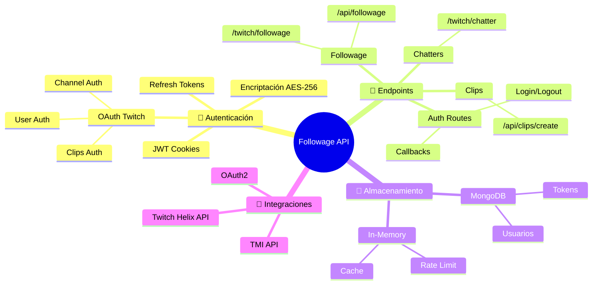

## 🏗️ Arquitectura del Sistema

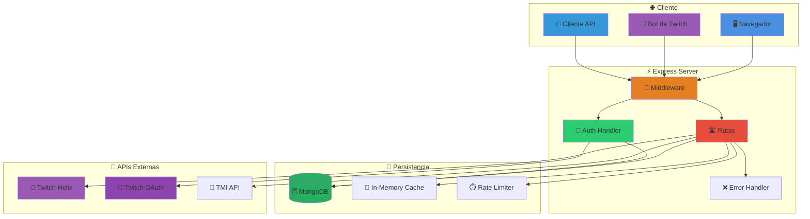

## 🔐 Flujo de Autenticación OAuth

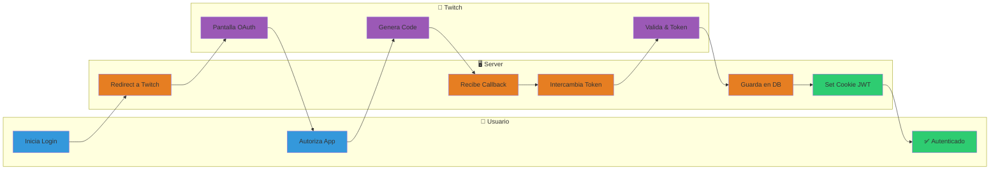

## 🎭 Tipos de Autenticación

```mermaid
graph TB
    subgraph "🔑 3 Tipos de Auth"
        direction TB
        
        subgraph "👤 User Auth"
            UA1["🎯 Scopes"]
            UA2["user:read:email + user:read:follows"]
            UA3["🍪 Cookie: auth"]
            UA4["📋 Uso: Followage propio"]
            UA1 --> UA2 --> UA3 --> UA4
        end
        
        subgraph "📺 Channel Auth"
            CA1["🎯 Scopes"]
            CA2["moderator:read:followers"]
            CA3["🍪 Cookie: channel_auth"]
            CA4["📋 Uso: Followage de canal"]
            CA1 --> CA2 --> CA3 --> CA4
        end
        
        subgraph "🎬 Clips Auth"
            CL1["🎯 Scopes"]
            CL2["clips:edit"]
            CL3["🍪 Cookie: clips_auth"]
            CL4["📋 Uso: Crear clips"]
            CL1 --> CL2 --> CL3 --> CL4
        end
    end
    
    style UA1 fill:#3498DB
    style UA2 fill:#5DADE2
    style UA3 fill:#85C1E9
    style UA4 fill:#AED6F1
    
    style CA1 fill:#E67E22
    style CA2 fill:#F39C12
    style CA3 fill:#F8C471
    style CA4 fill:#FAD7A0
    
    style CL1 fill:#9B59B6
    style CL2 fill:#AF7AC5
    style CL3 fill:#C39BD3
    style CL4 fill:#D7BDE2
```

## 🛣️ Mapa de Rutas

```mermaid
graph TB
    ROOT[🏠 Followage API]
    
    subgraph "🔐 Autenticación"
        AUTH_LOGIN["🚪 /auth/login"]
        AUTH_CHANNEL["📺 /auth/channel/login"]
        AUTH_CLIPS["🎬 /auth/clips/login"]
        AUTH_CB["↩️ /auth/callback"]
        AUTH_LOGOUT["🚪 /auth/logout"]
    end
    
    subgraph "👤 Info de Usuario"
        ME["👤 /me"]
        CHANNEL_ME["📺 /channel/me"]
        CLIPS_ME["🎬 /clips/me"]
    end
    
    subgraph "📊 Funcionalidades"
        FOLLOWAGE1["📈 /api/followage"]
        FOLLOWAGE2["📈 /twitch/followage/:s/:v"]
        CLIPS["🎬 /api/clips/create"]
        CHATTER["🎲 /twitch/chatter/:s"]
    end
    
    subgraph "🔧 Utilidades"
        HEALTH["💚 /health"]
        ERROR["❌ /error"]
        INDEX["🏠 /"]
    end
    
    ROOT --> AUTH_LOGIN
    ROOT --> AUTH_CHANNEL
    ROOT --> AUTH_CLIPS
    ROOT --> AUTH_CB
    ROOT --> AUTH_LOGOUT
    
    ROOT --> ME
    ROOT --> CHANNEL_ME
    ROOT --> CLIPS_ME
    
    ROOT --> FOLLOWAGE1
    ROOT --> FOLLOWAGE2
    ROOT --> CLIPS
    ROOT --> CHATTER
    
    ROOT --> HEALTH
    ROOT --> ERROR
    ROOT --> INDEX
    
    style ROOT fill:#E74C3C,color:#fff
    style AUTH_LOGIN fill:#3498DB
    style AUTH_CHANNEL fill:#E67E22
    style AUTH_CLIPS fill:#9B59B6
    style AUTH_CB fill:#2ECC71
    style AUTH_LOGOUT fill:#E74C3C
    style ME fill:#3498DB
    style CHANNEL_ME fill:#E67E22
    style CLIPS_ME fill:#9B59B6
    style FOLLOWAGE1 fill:#1ABC9C
    style FOLLOWAGE2 fill:#16A085
    style CLIPS fill:#9B59B6
    style CHATTER fill:#F39C12
    style HEALTH fill:#2ECC71
    style ERROR fill:#E74C3C
    style INDEX fill:#95A5A6
```

## 📈 Flujo: Consultar Followage

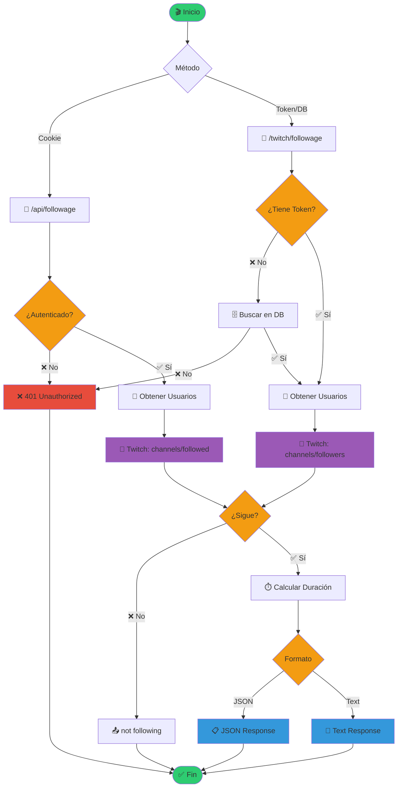

## 🎬 Flujo: Crear Clip

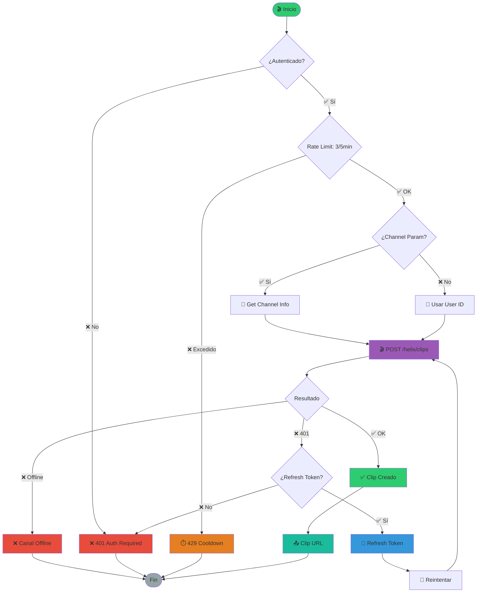

## 💾 Sistema de Almacenamiento

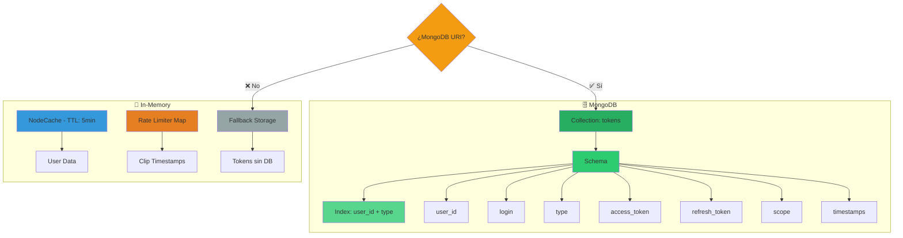

## 🔒 Seguridad y Tokens

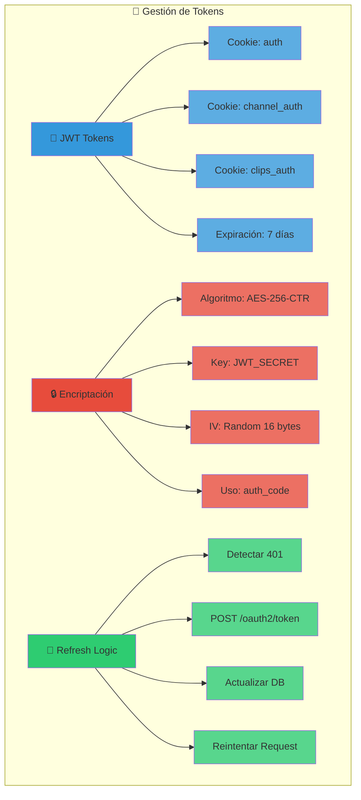

## ⚡ Middleware Pipeline

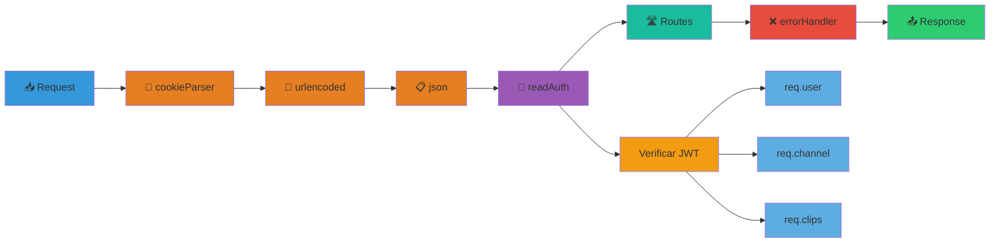

## 🔄 Retry & Error Handling

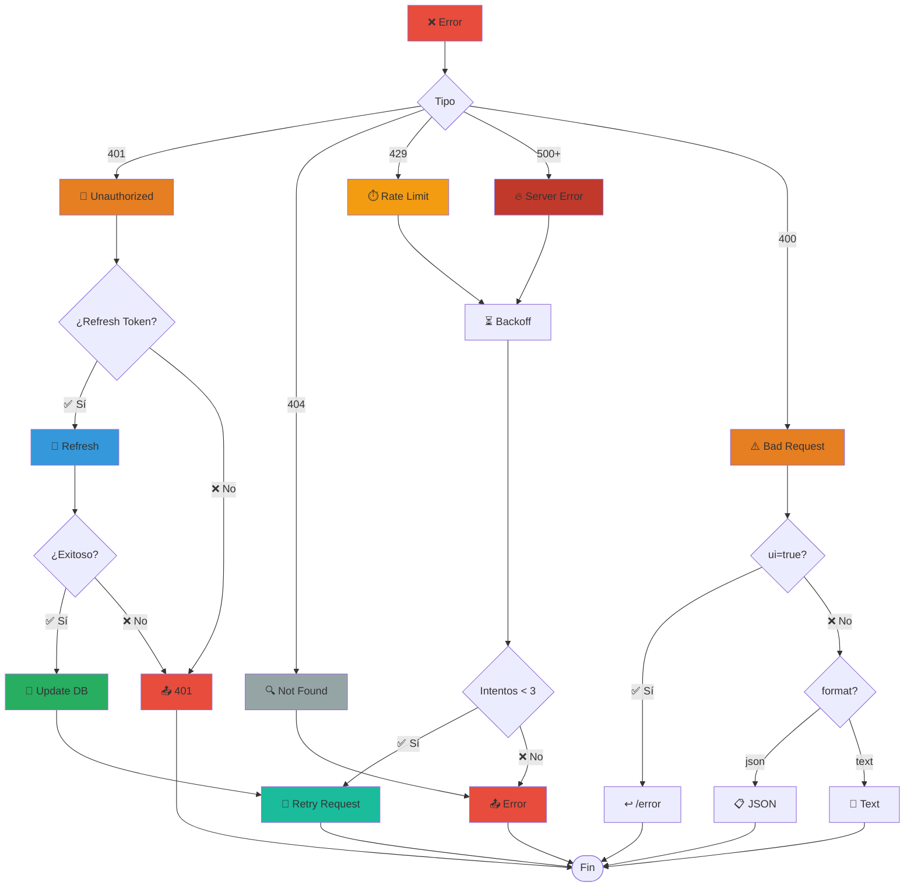

## 🌍 Deployment

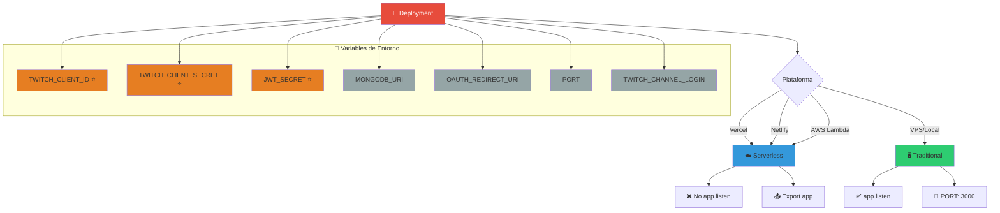

## 📊 Resumen de Endpoints

| Endpoint | Método | Auth | Función |
|----------|--------|------|---------|
| 🏠 `/` | GET | ❌ | Página principal |
| 💚 `/health` | GET | ❌ | Health check |
| 🚪 `/auth/login` | GET | ❌ | Login usuario |
| 📺 `/auth/channel/login` | GET | ❌ | Login canal |
| 🎬 `/auth/clips/login` | GET | ❌ | Login clips |
| ↩️ `/auth/callback` | GET | ❌ | Callback OAuth |
| 🚪 `/auth/logout` | POST | ❌ | Logout |
| 👤 `/me` | GET | 🍪 | Info usuario |
| 📺 `/channel/me` | GET | 🍪 | Info canal |
| 🎬 `/clips/me` | GET | 🍪 | Info clips |
| 📈 `/api/followage` | GET | 🍪 | Followage (cookie) |
| 📈 `/twitch/followage/:s/:v` | GET | 🔑 | Followage (token) |
| 🎬 `/api/clips/create` | POST/GET | 🔑 | Crear clip |
| 🎲 `/twitch/chatter/:s` | GET | ❌ | Chatter random |
| ❌ `/error` | GET | ❌ | Página error |

## 💡 Características Clave

> [!IMPORTANT]
> **🔐 Autenticación Multi-Método**
> - Cookies JWT (7 días de expiración)
> - Auth codes encriptados (AES-256-CTR)
> - Tokens en query params
> - Auto-refresh en expiración

> [!TIP]
> **⚡ Performance**
> - Cache de usuarios (5 min)
> - HTTP cache headers (30s + 60s stale)
> - Retry automático con backoff
> - Fallback a in-memory sin DB

> [!WARNING]
> **🛡️ Seguridad**
> - JWT_SECRET debe ser fuerte
> - Scopes específicos por función
> - Rate limiting en clips (3/5min)
> - Validación de parámetros

> [!NOTE]
> **🌍 Deployment**
> - Soporta serverless (Vercel, Netlify, Lambda)
> - Soporta tradicional (VPS, local)
> - MongoDB opcional (fallback in-memory)
> - Auto-detección de plataforma
