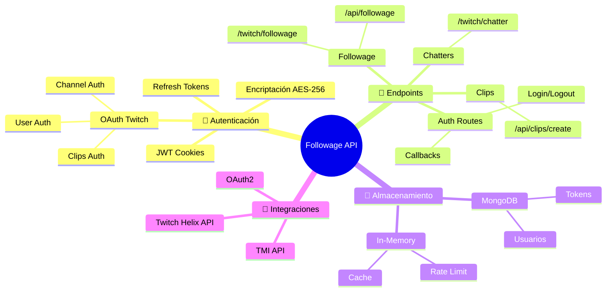
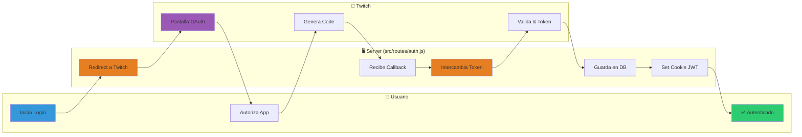
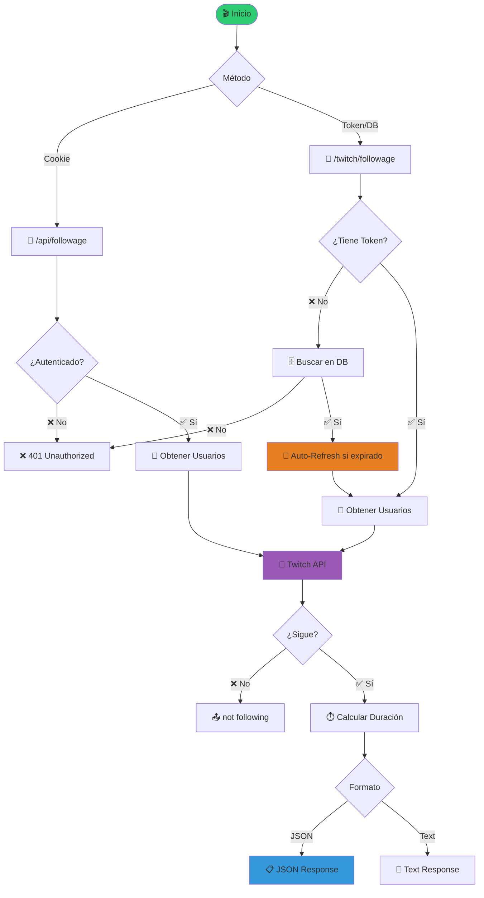
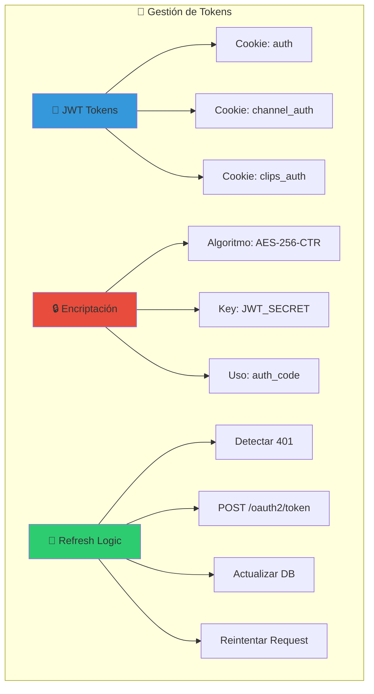

# 🗺️ Mapa Visual - LosPerris Followage API

## 🎯 Vista General del Sistema



## 🏗️ Arquitectura del Sistema (Refactorizada)

```mermaid
graph TB
    subgraph "🌐 Cliente"
        Browser[🖥️ Navegador]
        Bot[🤖 Bot de Twitch]
        API_Client[📱 Cliente API]
    end
    
    subgraph "⚡ Express Server (Modular)"
        Entry[🚀 src/server.js]
        
        subgraph "Middleware (src/middleware)"
            AuthMiddleware[🔐 auth.js (readAuth)]
            GlobalMiddleware[🔧 Global (json, cors)]
        end
        
        subgraph "Rutas (src/routes)"
            AuthRoute[🔐 auth.js]
            FollowRoute[📈 followage.js]
            ClipsRoute[🎬 clips.js]
            GenRoute[⚙️ general.js]
        end
        
        subgraph "Utilidades (src/utils)"
            AuthUtil[🛠️ auth.js]
        end
        
        Error[❌ Error Handler]
    end
    
    subgraph "💾 Persistencia"
        MongoDB[(🗄️ MongoDB)]
        Memory[💭 In-Memory Cache]
    end
    
    subgraph "🔗 APIs Externas"
        TwitchAPI[💜 Twitch Helix]
        TwitchOAuth[🔑 Twitch OAuth]
    end
    
    Browser --> Entry
    Bot --> Entry
    API_Client --> Entry
    
    Entry --> GlobalMiddleware
    GlobalMiddleware --> AuthMiddleware
    AuthMiddleware --> AuthRoute
    AuthMiddleware --> FollowRoute
    AuthMiddleware --> ClipsRoute
    AuthMiddleware --> GenRoute
    
    AuthRoute --> AuthUtil
    FollowRoute --> AuthUtil
    ClipsRoute --> AuthUtil
    
    AuthRoute --> MongoDB
    FollowRoute --> TwitchAPI
    ClipsRoute --> TwitchAPI
    
    AuthUtil --> TwitchOAuth
    AuthUtil --> MongoDB
    
    AuthRoute --> Error
    FollowRoute --> Error
    ClipsRoute --> Error
    GenRoute --> Error
    
    style Browser fill:#4A90E2
    style Bot fill:#9B59B6
    style Entry fill:#E74C3C
    style AuthMiddleware fill:#E67E22
    style AuthRoute fill:#3498DB
    style FollowRoute fill:#1ABC9C
    style ClipsRoute fill:#9B59B6
    style GenRoute fill:#F1C40F
    style AuthUtil fill:#2ECC71
    style MongoDB fill:#27AE60
```

## 🔐 Flujo de Autenticación OAuth



## 🛣️ Mapa de Rutas

```mermaid
graph TB
    ROOT[🏠 Server Entry]
    
    subgraph "🔐 src/routes/auth.js"
        AUTH_LOGIN["🚪 /auth/login"]
        AUTH_CHANNEL["📺 /auth/channel/login"]
        AUTH_CLIPS["🎬 /auth/clips/login"]
        AUTH_CB["↩️ /auth/callback"]
        AUTH_LOGOUT["🚪 /auth/logout"]
    end
    
    subgraph "⚙️ src/routes/general.js"
        ME["👤 /me"]
        CHANNEL_ME["📺 /channel/me"]
        CLIPS_ME["🎬 /clips/me"]
        HEALTH["💚 /health"]
        CHATTER["🎲 /twitch/chatter/:s"]
    end
    
    subgraph "📈 src/routes/followage.js"
        FOLLOWAGE1["📈 /api/followage"]
        FOLLOWAGE2["📈 /twitch/followage/:s/:v"]
    end
    
    subgraph "🎬 src/routes/clips.js"
        CLIPS["🎬 /api/clips/create"]
    end
    
    ROOT --> AUTH_LOGIN
    ROOT --> AUTH_CHANNEL
    ROOT --> AUTH_CLIPS
    ROOT --> AUTH_CB
    ROOT --> AUTH_LOGOUT
    
    ROOT --> ME
    ROOT --> CHANNEL_ME
    ROOT --> CLIPS_ME
    ROOT --> HEALTH
    ROOT --> CHATTER
    
    ROOT --> FOLLOWAGE1
    ROOT --> FOLLOWAGE2
    
    ROOT --> CLIPS
    
    style ROOT fill:#E74C3C,color:#fff
    style AUTH_LOGIN fill:#3498DB
    style ME fill:#3498DB
    style FOLLOWAGE1 fill:#1ABC9C
    style CLIPS fill:#9B59B6
```



## 📈 Flujo: Consultar Followage



## 🔒 Seguridad y Tokens (src/utils/auth.js)



## 📊 Resumen de Endpoints

| Endpoint | Método | Archivo | Función |
|----------|--------|---------|---------|
| 🏠 `/` | GET | `server.js` | Página principal |
| 💚 `/health` | GET | `general.js` | Health check |
| 🚪 `/auth/login` | GET | `auth.js` | Login usuario |
| 📺 `/auth/channel/login` | GET | `auth.js` | Login canal |
| 🎬 `/auth/clips/login` | GET | `auth.js` | Login clips |
| ↩️ `/auth/callback` | GET | `auth.js` | Callback OAuth |
| 🚪 `/auth/logout` | POST | `auth.js` | Logout |
| 👤 `/me` | GET | `general.js` | Info usuario |
| 📺 `/channel/me` | GET | `general.js` | Info canal |
| 🎬 `/clips/me` | GET | `general.js` | Info clips |
| 📈 `/api/followage` | GET | `followage.js` | Followage (cookie) |
| 📈 `/twitch/followage/:s/:v` | GET | `followage.js` | Followage (token) |
| 🎬 `/api/clips/create` | POST/GET | `clips.js` | Crear clip |
| 🎲 `/twitch/chatter/:s` | GET | `general.js` | Chatter random |
| ❌ `/error` | GET | `server.js` | Página error |
